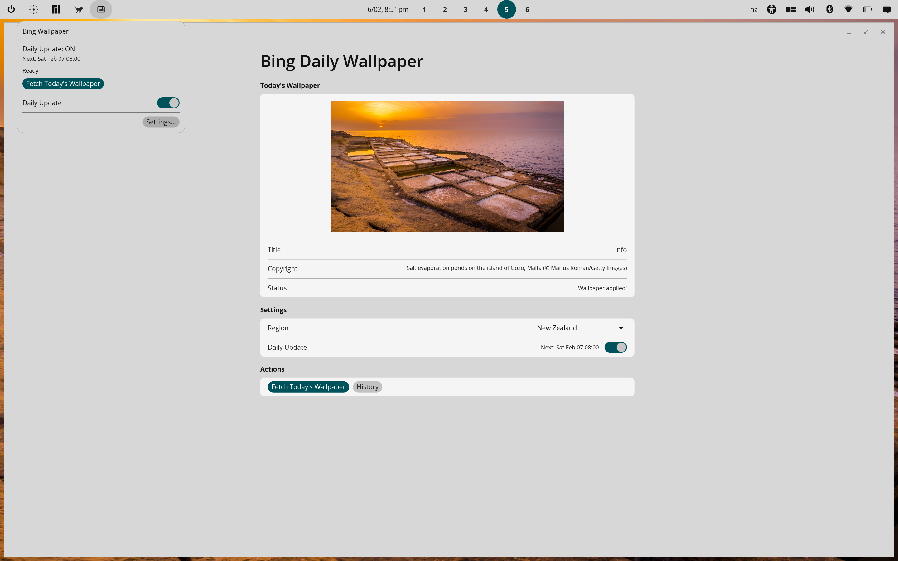
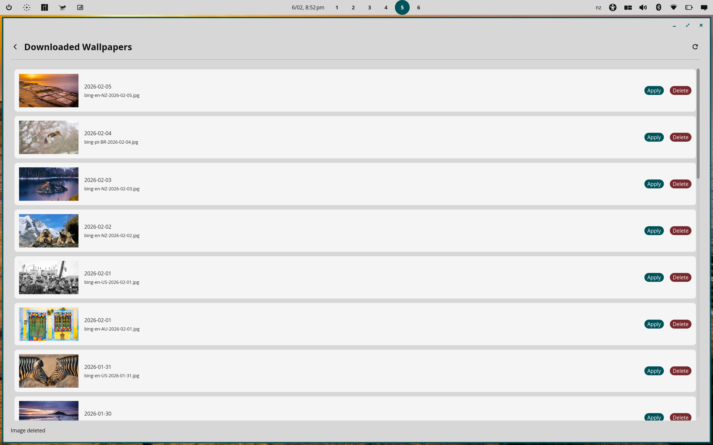

# Bing Wallpaper for COSMIC Desktop

A daily Bing wallpaper manager for the [COSMIC desktop environment](https://system76.com/cosmic) on Linux. Automatically fetches Microsoft Bing's beautiful "Image of the Day" and sets it as your desktop wallpaper.


This project was built collaboratively using AI-assisted development with [Claude Code](https://claude.ai/code). See [docs/AI-ASSISTED-DEVELOPMENT.md](docs/AI-ASSISTED-DEVELOPMENT.md) for the full story, lessons learned, and conversation transcripts.

---

## Overview

This project includes both a simple shell script for quick use and a native COSMIC panel applet with full settings window.

## Features

### Panel Applet (v0.4.0+)
- **Native COSMIC Integration**: Lives directly in the COSMIC panel as a native applet
- **Quick Popup**: Click the panel icon for instant access to controls
- **Fetch Wallpaper**: Download and apply today's Bing image with one click
- **Timer Toggle**: Enable/disable daily automatic updates from the popup
- **Status Display**: Shows timer state and next scheduled update

### Settings Window
- **Image Preview**: See today's Bing image before applying
- **History Browser**: Browse and re-apply previously downloaded wallpapers
- **Region Selector**: Choose from 21 Bing markets (US, UK, Germany, Japan, etc.)
- **One-click Apply**: Set any image as your desktop wallpaper instantly
- **Auto-Update Timer**: Enable/disable daily updates directly from settings
- **Status Display**: Shows next scheduled update time

### Shell Script
- Lightweight alternative for automation
- Can be run via cron or systemd timer
- No dependencies beyond curl and Python 3

## Screenshots



*Panel applet popup and settings window showing today's Bing image, region selector, and auto-update timer controls.*



*Browse and re-apply previously downloaded wallpapers.*

## Installation

### From Flathub

```bash
flatpak install flathub io.github.reality2_roycdavies.cosmic-bing-wallpaper
```

Then add the applet to your panel via **Panel Settings → Applets**.

### From Source (Flatpak)

Build and install the Flatpak package locally:

```bash
# Install flatpak-builder if not already installed
sudo apt install flatpak-builder  # Debian/Ubuntu/Pop!_OS
sudo pacman -S flatpak-builder    # Arch/Manjaro

# Install required Flatpak SDK (if not already installed)
flatpak install flathub org.freedesktop.Platform//25.08 org.freedesktop.Sdk//25.08
flatpak install flathub org.freedesktop.Sdk.Extension.rust-stable//25.08

# Clone the repository
git clone https://github.com/reality2-roycdavies/cosmic-bing-wallpaper.git
cd cosmic-bing-wallpaper

# Build and install the Flatpak (first build takes a while)
flatpak-builder --user --install --force-clean build-dir flathub/io.github.reality2_roycdavies.cosmic-bing-wallpaper.yml
```

Then add the applet to your panel via **Panel Settings → Applets**.

### From Source (Native)

Build with Cargo and install manually:

```bash
# Clone the repository
git clone https://github.com/reality2-roycdavies/cosmic-bing-wallpaper.git
cd cosmic-bing-wallpaper

# Build release binary
cargo build --release

# Install binary
sudo install -Dm755 target/release/cosmic-bing-wallpaper /usr/local/bin/cosmic-bing-wallpaper

# Install desktop entry (required for COSMIC to find the applet)
sudo install -Dm644 resources/io.github.reality2_roycdavies.cosmic-bing-wallpaper.desktop /usr/share/applications/io.github.reality2_roycdavies.cosmic-bing-wallpaper.desktop

# Install icons
sudo install -Dm644 resources/io.github.reality2_roycdavies.cosmic-bing-wallpaper.svg /usr/share/icons/hicolor/scalable/apps/io.github.reality2_roycdavies.cosmic-bing-wallpaper.svg
sudo install -Dm644 resources/io.github.reality2_roycdavies.cosmic-bing-wallpaper-symbolic.svg /usr/share/icons/hicolor/symbolic/apps/io.github.reality2_roycdavies.cosmic-bing-wallpaper-symbolic.svg
```

Then add the applet to your panel via **Panel Settings → Applets**.

### Uninstalling

```bash
# Flatpak
flatpak uninstall io.github.reality2_roycdavies.cosmic-bing-wallpaper

# Native
sudo rm /usr/local/bin/cosmic-bing-wallpaper
sudo rm /usr/share/applications/io.github.reality2_roycdavies.cosmic-bing-wallpaper.desktop
sudo rm /usr/share/icons/hicolor/scalable/apps/io.github.reality2_roycdavies.cosmic-bing-wallpaper.svg
sudo rm /usr/share/icons/hicolor/symbolic/apps/io.github.reality2_roycdavies.cosmic-bing-wallpaper-symbolic.svg
```

## Automatic Daily Updates

### From the Panel Applet or Settings

1. Click the applet icon in the panel, or open Settings
2. Toggle "Daily Update" to enable automatic updates
3. The wallpaper will automatically update daily at 8:00 AM

The timer runs within the applet process - no systemd services required. The applet starts automatically with the COSMIC panel.

## Configuration

Configuration is stored at `~/.config/cosmic-bing-wallpaper/config.json`:

| Option | Description | Default |
|--------|-------------|---------|
| `wallpaper_dir` | Directory where images are saved | `~/Pictures/BingWallpapers/` |
| `market` | Regional Bing market code (e.g., "en-US") | `en-US` |
| `auto_update` | Whether the daily update timer is enabled | `false` |
| `keep_days` | Days to keep old wallpapers before cleanup (0 = keep forever) | `30` |
| `fetch_on_startup` | Automatically fetch today's image when app starts | `true` |

## Supported Regions

| Region | Code | Region | Code |
|--------|------|--------|------|
| Australia | en-AU | Japan | ja-JP |
| Brazil | pt-BR | Netherlands | nl-NL |
| Canada | en-CA | New Zealand | en-NZ |
| China | zh-CN | Norway | nb-NO |
| Denmark | da-DK | Poland | pl-PL |
| Finland | fi-FI | Russia | ru-RU |
| France | fr-FR | South Korea | ko-KR |
| Germany | de-DE | Spain | es-ES |
| India | en-IN | Sweden | sv-SE |
| Italy | it-IT | United Kingdom | en-GB |
| | | United States | en-US |

## Project Structure

```
cosmic-bing-wallpaper/
├── Cargo.toml                         # Rust dependencies
├── README.md                          # This file
├── LICENSE                            # MIT License
├── flathub/                           # Flatpak manifest for building
├── src/
│   ├── main.rs                        # Entry point (applet/settings/fetch)
│   ├── applet.rs                      # COSMIC panel applet with popup
│   ├── settings.rs                    # Settings window (full UI)
│   ├── bing.rs                        # Bing API client
│   ├── config.rs                      # Configuration & markets
│   ├── service.rs                     # D-Bus service + wallpaper operations
│   ├── timer.rs                       # Internal timer for daily updates
│   └── dbus_client.rs                 # D-Bus client proxy (for settings)
└── resources/
    ├── *.desktop                      # Desktop entry (X-CosmicApplet)
    ├── *.svg                          # Application icons
    └── *.metainfo.xml                 # AppStream metadata
```

## How It Works

### Bing API

The app fetches images from Microsoft Bing's Homepage Image Archive API:
```
https://www.bing.com/HPImageArchive.aspx?format=js&idx=0&n=1&mkt=en-US
```

This returns JSON with the daily image URL, title, and copyright information.

### COSMIC Desktop Integration

Wallpapers are applied by:
1. Writing configuration to `~/.config/cosmic/com.system76.CosmicBackground/v1/all`
2. Using COSMIC's RON (Rusty Object Notation) format
3. Restarting the `cosmic-bg` process to load the new wallpaper

## Development

### Technology Stack
- **Rust** - Systems programming language
- **libcosmic** - COSMIC desktop toolkit (based on iced) with applet support
- **tokio** - Async runtime for non-blocking operations
- **reqwest** - HTTP client for API calls
- **serde** - JSON serialization/deserialization
- **zbus** - D-Bus IPC for applet/settings communication

### Architecture

The application uses a **panel applet** architecture with an embedded D-Bus service (v0.4.0+):

```
┌──────────────────────────────────────────────────┐
│            Panel Applet Process                   │
│  ┌────────────┐  ┌────────────┐  ┌────────────┐ │
│  │ D-Bus Svc  │  │  Timer     │  │ Panel Icon │ │
│  │ (service)  │  │ (internal) │  │ + Popup    │ │
│  └────────────┘  └────────────┘  └────────────┘ │
└──────────────────────────────────────────────────┘
        ▲
        │ D-Bus calls
┌───────┴───────────┐
│  Settings Window  │
│  (D-Bus client)   │
└───────────────────┘
```

#### Components

| Component | File | Purpose |
|-----------|------|---------|
| **Applet** | `applet.rs` | Native COSMIC panel applet with popup. Embeds D-Bus service and timer. |
| **Settings** | `settings.rs` | Full settings window with image preview, history browser, region selector. |
| **Service** | `service.rs` | D-Bus service managing wallpaper operations. |
| **Timer** | `timer.rs` | Internal async timer for daily updates (no systemd required). |
| **D-Bus Client** | `dbus_client.rs` | Proxy for settings window to communicate with applet. |

#### Key Design Points

- The applet runs as a native COSMIC panel applet (auto-starts with the panel)
- D-Bus service and timer run in a background thread within the applet process
- The settings window is a separate process launched via `--settings`
- No systemd, autostart, or lockfile management needed - COSMIC panel handles lifecycle

### Technical Documentation

See [DEVELOPMENT.md](DEVELOPMENT.md) for detailed technical learnings including:
- Panel applet implementation (v0.4.0+)
- D-Bus service architecture
- COSMIC desktop internals
- Flatpak compatibility

## License

MIT License - See [LICENSE](LICENSE) file for details.

## Contributing

Contributions are welcome! Please feel free to submit issues and pull requests.

## Acknowledgments

- [System76](https://system76.com) for the COSMIC desktop environment
- [Microsoft Bing](https://bing.com) for the beautiful daily images
- [Anthropic](https://anthropic.com) and Claude for AI-assisted development
