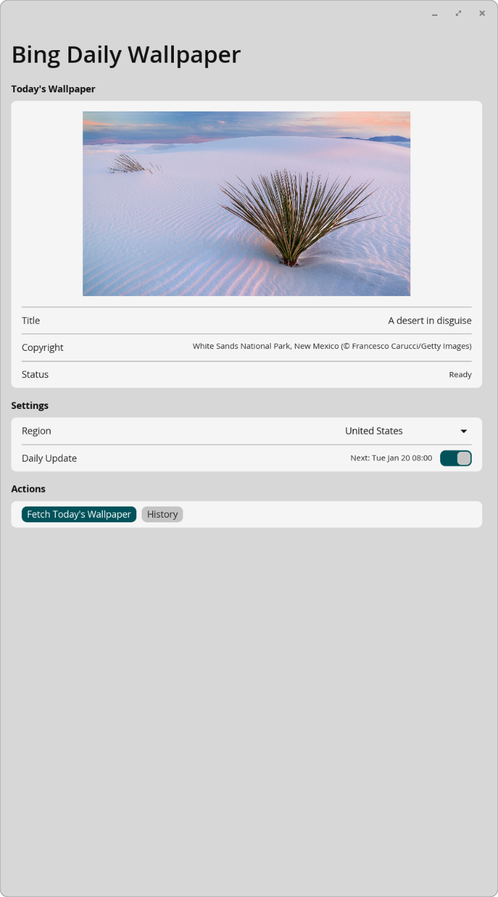
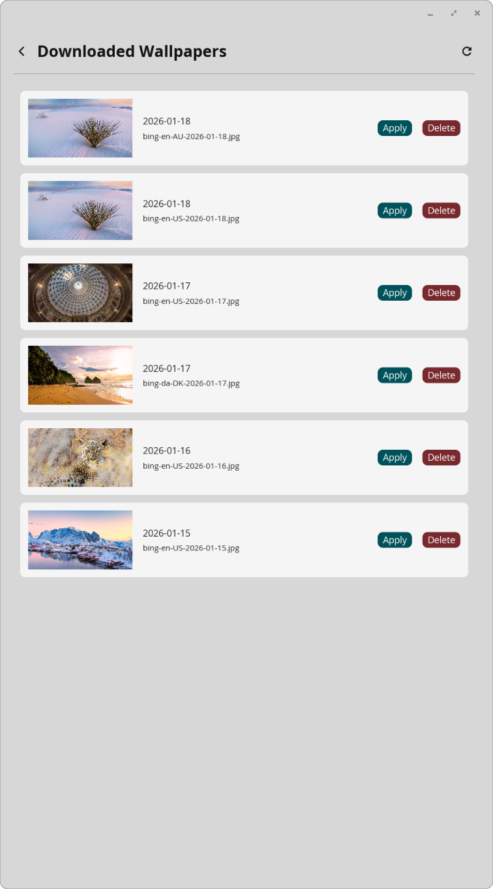

# Bing Wallpaper for COSMIC Desktop

A daily Bing wallpaper manager for the [COSMIC desktop environment](https://system76.com/cosmic) on Linux. Automatically fetches Microsoft Bing's beautiful "Image of the Day" and sets it as your desktop wallpaper.


> **Just want the app?** Skip to [Quick Start](#quick-start) for installation instructions.

---

## About This Project

> **This project is an educational showcase of AI-assisted software development.**

This application was created collaboratively by [Dr. Roy C. Davies](https://roycdavies.github.io) and [Claude](https://claude.ai) (Anthropic's AI) using [Claude Code](https://claude.ai/code). From initial idea to fully functional released application—complete with GUI, system tray, and AppImage packaging—in approximately **8 hours of active work** spread across four sessions. An additional **~4 hours** were later spent refactoring for Flatpak compatibility (see [FLATPAK-JOURNEY.md](docs/FLATPAK-JOURNEY.md)).

**The experiment:** The rule was that the human would write *no code at all*—not even comments, not even git commands. Every line of code, every commit, every file edit was performed by Claude. The human's role was purely to direct, question, test, and decide.

### Developer Reflection

*From Dr. Roy C. Davies:*

> I have learned very little about the actual mechanics of what the app does. Claude wrote the Rust code, the systemd service files, the build scripts. I directed, reviewed, tested, and made decisions—but I couldn't reproduce this from scratch without AI assistance.
>
> **Does that matter?** Perhaps not. Software development has always been about standing on the shoulders of giants. AI assistance is simply the next evolution.
>
> **Key insight:** While Claude is clever and solves problems well, **it still requires someone to ask the right questions**. The AI doesn't know what you want until you articulate it. It doesn't know something is broken until you test it and report back.
>
> **Testing has become even more important than before.** When you don't fully understand the code, your ability to verify it works correctly becomes your primary contribution. Knowing *what* to test, *how* to test it, and recognising when something isn't quite right—these skills are now more valuable than ever.

### Skills Required for AI-Assisted Development

**What skills does a human need to replicate this project?**

The human needs *technical literacy* but not *programming expertise*. Think of it as the difference between being able to read a map versus being a cartographer.

| Skill Category | Required | Not Required |
|---------------|----------|--------------|
| **Programming** | Ability to read code and understand *what* it does | Writing code, knowing syntax, understanding libraries |
| **Technical concepts** | Understanding of files, paths, processes, services | Deep knowledge of any specific technology |
| **Linux** | Comfort with terminal, basic commands (`cd`, `ls`, `cargo build`) | System administration, shell scripting |
| **Architecture** | Grasp of how software components fit together | Design patterns, framework internals |
| **Testing** | Methodical approach: try things, observe, report clearly | Automated testing, debugging tools |
| **Communication** | Precise description of problems and desired outcomes | Technical jargon or implementation details |

**The technical skill level:**

You need to be someone who:
- Can follow technical instructions without hand-holding
- Understands that software has configuration files, services, and dependencies
- Can recognise when error output indicates a problem (even without understanding the details)
- Is comfortable running commands in a terminal
- Can describe what they observe precisely ("the image appears in the right third of the box" vs "it's broken")

You do **not** need to:
- Know Rust, Python, or any specific language
- Understand the libcosmic framework or iced GUI toolkit
- Know how systemd works internally
- Be able to write or debug code yourself

**Approximate skill level:** A technically-inclined person who has installed Linux, configured some software, and isn't afraid of the command line. Perhaps someone who has done light scripting or web development, or a "power user" who enjoys tinkering. Not a professional developer, but not computer-naive either.

**The minimum viable skill set:**
1. **Technical comfort** — not intimidated by terminals, config files, or error messages
2. **Methodical testing** — systematically verify functionality, observe carefully, report precisely
3. **Domain understanding** — know what the software should do from a user's perspective
4. **Clear communication** — articulate requirements and problems without ambiguity
5. **Patience and persistence** — some problems take multiple iterations to solve

**What would this project take without AI assistance?**

For a solo developer with moderate Rust experience:
- Learning libcosmic/iced framework: **1-2 weeks**
- Core application development: **1-2 weeks**
- System tray implementation: **3-5 days**
- Systemd integration and packaging: **3-5 days**
- Testing and bug fixing: **1 week**
- **Total estimate: 4-6 weeks**

For a developer new to Rust:
- Learning Rust basics: **2-4 weeks**
- Plus all the above: **4-6 weeks**
- **Total estimate: 6-10 weeks**

With AI assistance, the initial scope was completed in **~8 hours of active work**, plus **~4 hours** for Flatpak refactoring—a productivity multiplier of roughly **30-50x** for this type of project.

### Lessons Learned (Retrospective)

After completion, we analysed what worked and what could have been better:

| What Worked | What Didn't |
|-------------|-------------|
| Organic, iterative development | Excessive iteration on "simple" problems (8+ attempts for image centering) |
| Human testing caught every real bug | Platform knowledge gaps (COSMIC specifics learned by trial and error) |
| The "no code" rule forced clear communication | Best practices not applied automatically (had to retrofit later) |
| Dedicated code review phase found 13 issues | All testing was manual; no automation |
| Documentation created alongside development | Scope grew without explicit milestone acknowledgments |

**Key insight for future projects:** Earlier and more frequent code reviews, upfront platform research, and explicit prompts for "what could go wrong?" would have made the process smoother.

*See [docs/RETROSPECTIVE.md](docs/RETROSPECTIVE.md) for the complete analysis.*

### What the Thematic Analysis Revealed

A thematic analysis of our conversation transcripts (also performed by Claude, but only after I asked for it) identified key patterns across 6 development sessions:

| Theme | Finding |
|-------|---------|
| **Human as Quality Gate** | Every significant bug was discovered through my testing, not by Claude |
| **Iterative Debugging** | Problems like image centering took 8+ attempts; autostart took 5 iterations |
| **Platform Knowledge Gaps** | Claude had general knowledge but missed COSMIC-specific details |
| **The Cost of Abstraction** | The "last 20%" (packaging, icons, autostart) consumed disproportionate effort |
| **Organic Scope Evolution** | The project grew from shell script → GUI → tray → systemd through dialogue |
| **External Knowledge Integration** | Solutions sometimes came from other AI tools (e.g., Gemini suggested pixmap approach) |
| **Architecture Emerges from Pain** | The daemon+clients model emerged only after synchronization problems became clear |
| **Sandbox Path Isolation** | Flatpak's sandboxed paths differ from host paths—broke COSMIC integration |
| **Incremental Permission Discovery** | Flatpak permissions discovered through runtime errors, not documentation |
| **Cross-Distribution Testing** | Apps working on Manjaro failed on Pop!_OS due to SDK version differences |

The emerging model of AI-assisted development:

| Role | AI | Human |
|------|:---:|:-----:|
| Write code | ✓ | |
| Fix compilation errors | ✓ | |
| Propose solutions | ✓ | |
| Test in real environment | | ✓ |
| Recognise incorrect behaviour | | ✓ |
| Test across session boundaries | | ✓ |
| **Test across distributions** | | ✓ |
| Make final decisions | | ✓ |
| Know when to stop | | ✓ |

The human becomes an **editor, tester, and director**—roles that require understanding *what* software should do, even without knowing *how* to implement it. Cross-distribution testing is now an essential human responsibility.

*See [docs/THEMATIC-ANALYSIS.md](docs/THEMATIC-ANALYSIS.md) for the complete analysis (26 themes across 6 sessions).*

### Educational Resources

| Resource | Description |
|----------|-------------|
| [docs/DEVELOPMENT.md](docs/DEVELOPMENT.md) | Technical journey from concept to release |
| [docs/THEMATIC-ANALYSIS.md](docs/THEMATIC-ANALYSIS.md) | 26 themes identified in AI-human collaboration patterns |
| [docs/RETROSPECTIVE.md](docs/RETROSPECTIVE.md) | What worked, what didn't, and lessons for future projects |
| **Conversation Transcripts** | |
| [Part 1: Creation](docs/transcripts/CONVERSATION-PART1-CREATION.md) | Initial development from shell script to GUI application |
| [Part 2: Refinement](docs/transcripts/CONVERSATION-PART2-REFINEMENT.md) | Bug fixes, system tray, systemd integration, packaging |
| [Part 3: Code Review](docs/transcripts/CONVERSATION-PART3-CODE-REVIEW.md) | Edge case analysis and 13 fixes |
| [Part 4: Architecture & Polish](docs/transcripts/CONVERSATION-PART4-ARCHITECTURE.md) | D-Bus daemon refactoring, theme-aware icons, colored indicators |
| [Part 6: Cross-Distribution Flatpak](docs/transcripts/CONVERSATION-PART6-FLATPAK.md) | Flatpak debugging on Pop!_OS after development on Manjaro |
| [Raw transcripts](docs/transcripts/) | JSONL files for programmatic analysis |

---

## Overview

This project includes both a simple shell script for quick use and a full native COSMIC GUI application.

## Features

### GUI Application
- **Image Preview**: See today's Bing image before applying
- **History Browser**: Browse and re-apply previously downloaded wallpapers
- **Region Selector**: Choose from 21 Bing markets (US, UK, Germany, Japan, etc.)
- **One-click Apply**: Set any image as your desktop wallpaper instantly
- **Auto-Update Timer**: Enable/disable daily updates directly from the app
- **Status Display**: Shows next scheduled update time

### System Tray Mode
- **Background Operation**: Run quietly in the system tray
- **Quick Access**: Right-click menu for common actions
- **Fetch Wallpaper**: Download today's image without opening the full app
- **Open App**: Launch the full GUI when needed
- **Theme-Aware Icons**: Dynamically generated using COSMIC theme colors (v0.3.4+)
- **Status Indicators**: Accent-colored tick (enabled) / gray cross (disabled) for visibility (v0.3.4+)
- **Toggle Timer**: Enable/disable daily updates with instant visual feedback
- **Instant Sync**: Changes in GUI immediately reflected in tray via D-Bus

### Shell Script
- Lightweight alternative for automation
- Can be run via cron or systemd timer
- No dependencies beyond curl and Python 3

## Screenshots



*Main application window showing today's Bing image, region selector, and auto-update timer controls.*



*Browse and re-apply previously downloaded wallpapers.*

## Installation

Build and install the Flatpak package from GitHub:

```bash
# Install flatpak-builder if not already installed
sudo apt install flatpak-builder  # Debian/Ubuntu/Pop!_OS
sudo pacman -S flatpak-builder    # Arch/Manjaro

# Install required Flatpak SDK (if not already installed)
flatpak install flathub org.freedesktop.Platform//25.08 org.freedesktop.Sdk//25.08
flatpak install flathub org.freedesktop.Sdk.Extension.rust-stable//25.08

# Clone the repository
git clone https://github.com/reality2-roycdavies/cosmic-bing-wallpaper.git
cd cosmic-bing-wallpaper

# Build and install the Flatpak (first build takes a while)
flatpak-builder --user --install --force-clean build-dir flathub/io.github.reality2_roycdavies.cosmic-bing-wallpaper.yml

# Run the app
flatpak run io.github.reality2_roycdavies.cosmic-bing-wallpaper

# Or start the tray (will auto-start on future logins)
flatpak run io.github.reality2_roycdavies.cosmic-bing-wallpaper --tray
```

### Uninstalling

```bash
flatpak uninstall io.github.reality2_roycdavies.cosmic-bing-wallpaper
```

## Automatic Daily Updates

### From the GUI or Tray

1. Open the application (or right-click the tray icon)
2. Toggle "Daily Update" to enable automatic updates
3. The wallpaper will automatically update daily at 8:00 AM

The timer runs within the tray process - no systemd services required. This makes the app fully compatible with Flatpak sandboxes.

## System Tray Mode

Run the app in the background with a system tray icon for quick access:

```bash
flatpak run io.github.reality2_roycdavies.cosmic-bing-wallpaper --tray
```

The tray icon provides a right-click menu with:
- **Fetch Today's Wallpaper**: Download and apply the latest Bing image
- **Toggle Daily Update**: Enable/disable automatic daily updates
- **Settings**: Launch the full GUI window
- **Quit**: Exit the tray application

The tray automatically creates an XDG autostart entry on first run, so it will start on login.

## Configuration

Configuration is stored at `~/.config/cosmic-bing-wallpaper/config.json`:

| Option | Description | Default |
|--------|-------------|---------|
| `wallpaper_dir` | Directory where images are saved | `~/Pictures/BingWallpapers/` |
| `market` | Regional Bing market code (e.g., "en-US") | `en-US` |
| `auto_update` | Whether the daily update timer is enabled | `false` |
| `keep_days` | Days to keep old wallpapers before cleanup (0 = keep forever) | `30` |
| `fetch_on_startup` | Automatically fetch today's image when app starts | `true` |

## Supported Regions

| Region | Code | Region | Code |
|--------|------|--------|------|
| Australia | en-AU | Japan | ja-JP |
| Brazil | pt-BR | Netherlands | nl-NL |
| Canada | en-CA | New Zealand | en-NZ |
| China | zh-CN | Norway | nb-NO |
| Denmark | da-DK | Poland | pl-PL |
| Finland | fi-FI | Russia | ru-RU |
| France | fr-FR | South Korea | ko-KR |
| Germany | de-DE | Spain | es-ES |
| India | en-IN | Sweden | sv-SE |
| Italy | it-IT | United Kingdom | en-GB |
| | | United States | en-US |

## Project Structure

```
cosmic-bing-wallpaper/
├── README.md                          # This file
├── LICENSE                            # MIT License
├── flathub/                           # Flatpak manifest for building
└── cosmic-bing-wallpaper/             # COSMIC GUI application
    ├── Cargo.toml                     # Rust dependencies
    ├── src/
    │   ├── main.rs                    # Entry point (GUI/Tray modes)
    │   ├── app.rs                     # COSMIC app (UI + state)
    │   ├── bing.rs                    # Bing API client
    │   ├── config.rs                  # Configuration & markets
    │   ├── service.rs                 # D-Bus service (embedded in tray)
    │   ├── timer.rs                   # Internal timer for daily updates
    │   ├── dbus_client.rs             # D-Bus client proxy (for GUI)
    │   └── tray.rs                    # System tray with embedded service
    └── resources/
        ├── *.desktop                  # Desktop entry file
        ├── *.svg                      # Application icons
        └── *.metainfo.xml             # AppStream metadata
```

## How It Works

### Bing API

The app fetches images from Microsoft Bing's Homepage Image Archive API:
```
https://www.bing.com/HPImageArchive.aspx?format=js&idx=0&n=1&mkt=en-US
```

This returns JSON with the daily image URL, title, and copyright information.

### COSMIC Desktop Integration

Wallpapers are applied by:
1. Writing configuration to `~/.config/cosmic/com.system76.CosmicBackground/v1/all`
2. Using COSMIC's RON (Rusty Object Notation) format
3. Restarting the `cosmic-bg` process to load the new wallpaper

## Development

### Technology Stack
- **Rust** - Systems programming language
- **libcosmic** - COSMIC desktop GUI toolkit (based on iced)
- **tokio** - Async runtime for non-blocking operations
- **reqwest** - HTTP client for API calls
- **serde** - JSON serialization/deserialization
- **zbus** - D-Bus IPC for daemon/client communication
- **ksni** - StatusNotifierItem (system tray) protocol
- **notify** - File system watching for theme changes

### Architecture

The application uses a **tray-with-embedded-service** architecture for Flatpak compatibility:

```
┌──────────────────────────────────────────────────┐
│               Tray Process                        │
│  ┌────────────┐  ┌────────────┐  ┌────────────┐ │
│  │ D-Bus Svc  │  │  Timer     │  │  Tray Icon │ │
│  │ (service)  │  │ (internal) │  │  (ksni)    │ │
│  └────────────┘  └────────────┘  └────────────┘ │
└──────────────────────────────────────────────────┘
        ▲
        │ D-Bus calls
┌───────┴───────┐
│      GUI      │
│ (D-Bus client)│
└───────────────┘
```

#### Components

| Component | File | Purpose |
|-----------|------|---------|
| **Service** | `service.rs` | D-Bus service embedded in tray, managing wallpaper operations and timer control. |
| **Timer** | `timer.rs` | Internal async timer for daily updates (no systemd required). |
| **GUI Client** | `app.rs` | Full application window using libcosmic. Communicates with tray's D-Bus service. |
| **Tray** | `tray.rs` | System tray with embedded service. Theme-aware icons via inotify file watching. |
| **D-Bus Client** | `dbus_client.rs` | Proxy for GUI to communicate with tray's service. |

#### D-Bus Interface

The tray exposes `org.cosmicbing.Wallpaper1` with these methods and signals:

**Methods:**
| Method | Description |
|--------|-------------|
| `FetchWallpaper(apply: bool) → WallpaperInfo` | Fetch today's wallpaper, optionally apply |
| `ApplyWallpaper(path: String)` | Apply a specific wallpaper file |
| `GetConfig() → String` | Get full config as JSON |
| `GetMarket() → String` | Get current market code |
| `SetMarket(market: String)` | Set market code |
| `GetWallpaperDir() → String` | Get wallpaper storage directory |
| `GetTimerEnabled() → bool` | Check if daily timer is enabled |
| `SetTimerEnabled(enabled: bool)` | Enable/disable daily timer |
| `GetTimerNextRun() → String` | Get next scheduled run time |
| `GetCurrentWallpaperPath() → String` | Get path of currently applied wallpaper |
| `GetHistory() → Vec<WallpaperInfo>` | List downloaded wallpapers |
| `DeleteWallpaper(path: String)` | Delete a wallpaper file |

**Signals:**
| Signal | Description |
|--------|-------------|
| `WallpaperChanged(path, title)` | Emitted when wallpaper is applied |
| `TimerStateChanged(enabled)` | Emitted when timer state changes |
| `FetchProgress(state, message)` | Progress updates during fetch |

#### Why This Architecture?

The previous daemon+clients model used systemd for:
- Running a separate daemon process
- Timer-based scheduling
- Auto-starting on login

This didn't work in Flatpak sandboxes. The new architecture:
- **Embedded service**: D-Bus service runs inside the tray process
- **Internal timer**: Scheduling handled by async Rust code, not systemd
- **XDG autostart**: Login startup via standard `.desktop` files
- **Flatpak compatible**: No systemd dependencies

The GUI follows the Model-View-Update (MVU) pattern:
- **Model** (`BingWallpaper`): Application state
- **View** (`view_main`, `view_history`): UI rendering
- **Update** (`update`): Message handling and state transitions

### System Tray Features (v0.1.4+)

- **Dynamic theme icons**: Icons generated at runtime using COSMIC theme foreground and accent colors
- **Instant theme detection**: Uses inotify file watching (no polling) on COSMIC's theme config
- **Status indicators**: Accent-colored tick (timer ON) / gray cross (timer OFF) with white marks
- **External state sync**: Detects timer changes made by GUI and updates icon accordingly

### Technical Documentation

See [cosmic-bing-wallpaper/DEVELOPMENT.md](cosmic-bing-wallpaper/DEVELOPMENT.md) for detailed technical learnings including:
- System tray implementation challenges and solutions
- D-Bus daemon architecture
- Dark/light mode detection
- COSMIC desktop internals

## License

MIT License - See [LICENSE](LICENSE) file for details.

## Contributing

Contributions are welcome! Please feel free to submit issues and pull requests.

## Acknowledgments

- [System76](https://system76.com) for the COSMIC desktop environment
- [Microsoft Bing](https://bing.com) for the beautiful daily images
- [Anthropic](https://anthropic.com) and Claude for AI-assisted development
